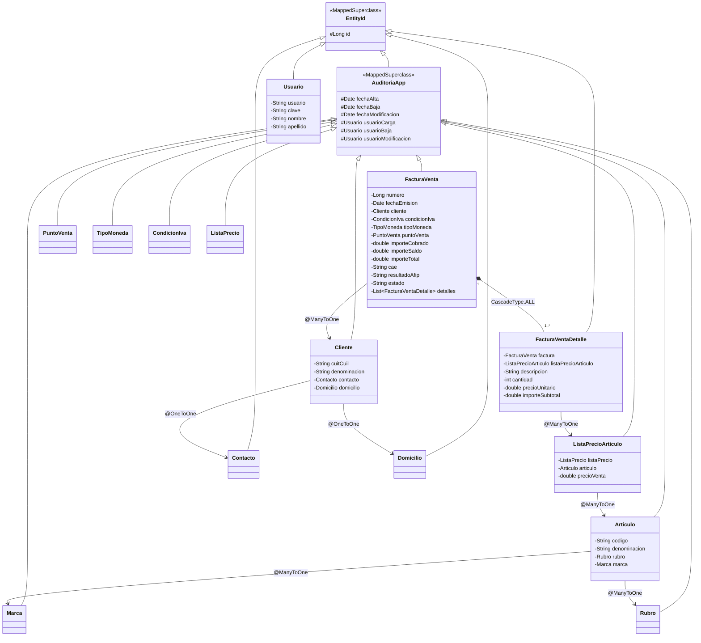

# Sistema de Facturación Comercial Integrado con AFIP - JPA & JPQL

Proyecto desarrollado con **Java 17**, **Jakarta Persistence API (JPA 3.0)** e **Hibernate ORM 6.6**. Representa la evolución y reestructuración de un modelo de pedidos inicial hacia un **Sistema de Facturación Comercial Integrado con AFIP**, implementando patrones avanzados de persistencia, superclases mapeadas para auditoría, persistencia en cascada (`CascadeType.ALL`) y una capa de servicio dedicada para la ejecución de consultas orientadas a objetos con **JPQL (Java Persistence Query Language)**.

---

## 1. Descripción del Proyecto y Evolución

El proyecto original modelaba un circuito básico de pedidos y productos en memoria/H2. En esta entrega, la arquitectura se refactorizó integralmente para dar soporte a las normativas y requerimientos del circuito comercial y tributario argentino (AFIP):

- **Migración del Dominio:** Se reemplazó el esquema anterior (`Pedido`, `Producto`, `Categoria`) por un modelo formal de comprobantes fiscales electrónicos (`FacturaVenta`, `FacturaVentaDetalle`, `PuntoVenta`, `TipoMoneda`, `CondicionIva`, `Cliente`, `Articulo`, `ListaPrecio`, etc.).
- **Trazabilidad y Auditoría:** Toda entidad de negocio hereda de superclases mapeadas (`@MappedSuperclass`) que garantizan identidad unificada y registro automático de fechas y usuarios de alta, modificación y baja.
- **Persistencia en Cascada:** Mapeo de la relación cabecera-detalle mediante `@OneToMany(mappedBy = "factura", cascade = CascadeType.ALL, orphanRemoval = true)`, permitiendo que la persistencia de la factura guarde automáticamente todos sus ítems hijos con un único llamado a `em.persist(facturaVenta)`.
- **Capa de Consultas JPQL (`FacturacionService`):** Desacoplamiento de la lógica de acceso a datos mediante consultas orientadas a objetos fuertemente tipadas, filtrado por atributos únicos, navegación de relaciones con `JOIN`, y funciones de agregación (`SUM`, `COUNT`).

---

## 2. Diagrama y Arquitectura del Dominio

### Jerarquía de Herencia (`@MappedSuperclass`)

```
               +-----------------------------+
               |          EntityId           |  <- @MappedSuperclass
               |-----------------------------|
               | # id: Long (@Id @Generated) |
               +-----------------------------+
                              ^
                              | (extends)
               +-----------------------------+
               |        AuditoriaApp         |  <- @MappedSuperclass
               |-----------------------------|
               | # fechaAlta: Date           |
               | # fechaBaja: Date           |
               | # fechaModificacion: Date   |
               | # usuarioCarga: Usuario     |
               | # usuarioBaja: Usuario      |
               | # usuarioModificacion: Usu. |
               +-----------------------------+
```

1. **`EntityId`:** Superclase base abstracta que define la clave primaria universal `protected Long id` con estrategia de generación `GenerationType.IDENTITY`.
2. **`AuditoriaApp`:** Hereda de `EntityId` y agrega los metadatos de auditoría requeridos para el control interno contable:
   - `fechaAlta` (`@Temporal(TemporalType.TIMESTAMP)`)
   - `fechaBaja` (`@Temporal(TemporalType.TIMESTAMP)`)
   - `fechaModificacion` (`@Temporal(TemporalType.TIMESTAMP)`, `@Column(nullable = false)`)
   - `usuarioCarga` (`@ManyToOne`, `@JoinColumn(nullable = false)`)
   - `usuarioBaja` (`@ManyToOne`, `@JoinColumn(nullable = true)`)
   - `usuarioModificacion` (`@ManyToOne`, `@JoinColumn(nullable = false)`)

### Diagrama de Clases y Relaciones (Mermaid)



---

## 3. Configuración de la Base de Datos (MySQL / XAMPP)

El proyecto utiliza **MySQL** como motor de persistencia relacional configurado en el archivo `src/main/resources/META-INF/persistence.xml`.

### Parámetros de Conexión

- **Nombre de la Unidad de Persistencia:** `FacturacionPU`
- **Proveedor:** `org.hibernate.jpa.HibernatePersistenceProvider`
- **Driver JDBC:** `com.mysql.cj.jdbc.Driver`
- **URL JDBC:** `jdbc:mysql://localhost:3306/facturacion_db?createDatabaseIfNotExist=true&useSSL=false&allowPublicKeyRetrieval=true&serverTimezone=UTC`
- **Usuario por defecto:** `root`
- **Contraseña por defecto:** `root` (o vacía según configuración de XAMPP)
- **Estrategia DDL:** `hibernate.hbm2ddl.auto = update` (crea y actualiza automáticamente las 14 tablas en la base de datos).

### Pasos para Conectar con XAMPP:

1. Iniciar el panel de control de **XAMPP** y arrancar el módulo **MySQL** (verificando que esté escuchando en el puerto `3306`).
2. Abrir **phpMyAdmin** (`http://localhost/phpmyadmin`).
3. La base de datos `facturacion_db` se crea de manera automática al ejecutar la aplicación gracias al parámetro `createDatabaseIfNotExist=true`. Opcionalmente, puede crearse manualmente con:
   ```sql
   CREATE DATABASE IF NOT EXISTS facturacion_db CHARACTER SET utf8mb4 COLLATE utf8mb4_spanish_ci;
   ```
4. Al iniciar la aplicación, Hibernate ejecutará el esquema DDL y generará las tablas: `usuarios`, `facturas_venta`, `facturas_venta_detalles`, `puntos_venta`, `clientes`, `contactos`, `domicilios`, `condiciones_iva`, `tipos_moneda`, `articulos`, `marcas`, `rubros`, `listas_precios` y `listas_precio_articulos`.

---

## 4. Demostración de Funcionalidades

### A. Persistencia en Cascada (`CascadeType.ALL`)

El ciclo contable de facturación exige que una factura y sus ítems de detalle se gestionen como una unidad atómica (Aggregate Root). En `FacturaVenta.java`:

```java
@OneToMany(mappedBy = "factura", cascade = CascadeType.ALL, orphanRemoval = true)
private List<FacturaVentaDetalle> detalles = new ArrayList<>();

public void addDetalle(FacturaVentaDetalle detalle) {
    this.detalles.add(detalle);
    detalle.setFactura(this); // Mantiene sincronía bidireccional
}
```

En la clase principal o capa de servicio:
```java
// Se instancian la factura cabecera y sus renglones
FacturaVenta factura = new FacturaVenta();
factura.addDetalle(detalle1);
factura.addDetalle(detalle2);

// REQUISITO CLAVE: Se persiste ÚNICAMENTE la cabecera
em.persist(factura);
// Los detalles se insertan automáticamente en la tabla facturas_venta_detalles
```

### B. Capa de Consultas JPQL (`FacturacionService.java`)

La clase `FacturacionService` encapsula las consultas orientadas a objetos, garantizando separación de responsabilidades y reutilización:

| Categoría | Método | Consulta JPQL |
|---|---|---|
| **Filtro Único** | `buscarUsuarioPorNombreUsuario(usuario)` | `SELECT u FROM Usuario u WHERE u.usuario = :usuario` |
| **Filtro Único** | `buscarClientePorCuit(cuitCuil)` | `SELECT c FROM Cliente c WHERE c.cuitCuil = :cuitCuil` |
| **Filtro Único** | `buscarArticuloPorCodigo(codigo)` | `SELECT a FROM Articulo a WHERE a.codigo = :codigo` |
| **Relaciones / Joins** | `buscarFacturasPorClienteCuit(cuitCuil)` | `SELECT f FROM FacturaVenta f JOIN f.cliente c WHERE c.cuitCuil = :cuitCuil ORDER BY f.fechaEmision DESC` |
| **Navegación** | `buscarDetallesPorNumeroFactura(nro)` | `SELECT d FROM FacturaVentaDetalle d WHERE d.factura.numero = :numeroFactura` |
| **Agregación (SUM)** | `calcularImporteTotalFacturadoGeneral()` | `SELECT COALESCE(SUM(f.importeTotal), 0.0) FROM FacturaVenta f` |
| **Agregación (COUNT)** | `contarFacturasPorPuntoVenta(pv)` | `SELECT COUNT(f) FROM FacturaVenta f WHERE f.puntoVenta.numero = :numeroPuntoVenta` |

### Ejemplo de Salida por Consola (`Main.java`):

```text
================================================================================
    SISTEMA DE FACTURACIÓN COMERCIAL INTEGRADO CON AFIP - JPA & JPQL
================================================================================
[INFO] Base de datos inicializada y datos de prueba persistidos en cascada (CascadeType.ALL).

--------------------------------------------------------------------------------
1. BÚSQUEDAS POR ATRIBUTOS ÚNICOS / FILTROS (JPQL)
--------------------------------------------------------------------------------
 -> [USUARIO ENCONTRADO] ID: 1 | Username: admin | Nombre: Lucas Moreira
 -> [CLIENTE ENCONTRADO] ID: 1 | CUIT: 30-71234567-9 | Denominación: Tech Corp S.A. | Contacto: info@techcorp.com | Domicilio: Av. España 500
 -> [ARTÍCULO ENCONTRADO] ID: 1 | Código: LEN-T14 | Denominación: Notebook Lenovo ThinkPad T14 Gen 4 | Marca: Lenovo | Rubro: Computación e Informática

--------------------------------------------------------------------------------
2. CONSULTAS CON JOINS Y NAVEGACIÓN ORIENTADA A OBJETOS (JPQL)
--------------------------------------------------------------------------------
 -> Facturas emitidas al cliente CUIT '30-71234567-9' (1 encontradas):
    * Factura Nro: 1001 | Fecha: 2026-09-21 | Estado: AUTORIZADA | CAE: 73259821456987 | Total: $3070000.00

 -> Ítems de Detalle asociados a la Factura Nro 1001 (2 renglones):
    * Detalle ID: 1 | Cantidad: 2 | Descripción: 'Notebook Lenovo ThinkPad T14 Gen 4 - Core i7 16GB' | Precio Unit: $1500000.00 | Subtotal: $3000000.00
    * Detalle ID: 2 | Cantidad: 2 | Descripción: 'Mouse Inalámbrico Lenovo M70' | Precio Unit: $35000.00 | Subtotal: $70000.00

--------------------------------------------------------------------------------
3. CONSULTAS DE AGREGACIÓN Y MÉTRICAS COMERCIALES (JPQL)
--------------------------------------------------------------------------------
 -> Total Facturado General (SUM): $3070000.00
 -> Cantidad de Facturas emitidas en Punto de Venta 1 (COUNT): 1 comprobante(s)
================================================================================
    EJECUCIÓN DEL SERVICIO JPQL COMPLETADA CON ÉXITO
================================================================================
```

---

## 5. Instrucciones para Compilar y Ejecutar

### Requisitos Previos:
- **Java Development Kit (JDK):** Versión 17 o superior.
- **Apache Maven:** Versión 3.8+.
- **MySQL / MariaDB:** Corriendo localmente (ej. vía XAMPP en puerto 3306) para la ejecución en vivo de `Main.java`.

### Comandos de Ejecución:

1. **Ejecutar Pruebas Automatizadas (Unit Tests):**
   Las pruebas unitarias utilizan una base de datos H2 en memoria configurada con compatibilidad MySQL, lo que permite validar la persistencia en cascada y todas las consultas JPQL sin requerir un servidor MySQL en ejecución.
   ```bash
   mvn clean test
   ```

2. **Compilar el Proyecto:**
   ```bash
   mvn clean compile
   ```

3. **Ejecutar la Aplicación Principal:**
   Ejecuta el método `main` de `ar.edu.practica.jpa.Main` que puebla los datos de prueba y ejecuta las consultas JPQL:
   ```bash
   mvn exec:java
   ```
   *O ejecutar directamente la clase `Main.java` desde IntelliJ IDEA, Eclipse o VS Code.*

---

## 6. Buenas Prácticas y Patrones de Persistencia Aplicados

- **Separación de Responsabilidades (SRP):** La lógica de consultas JPQL se aísla en `FacturacionService`, dejando `Main` como orquestador.
- **Centralización de Unidad de Persistencia (`JpaUtil`):** Patrón Singleton para el ciclo de vida del `EntityManagerFactory`.
- **Mapeo Bidireccional Seguro:** Métodos utilitarios (`addDetalle`, `removeDetalle`) para garantizar sincronización en memoria entre cabecera y detalles.
- **Consultas Tipadas (`TypedQuery`):** Uso de queries fuertemente tipadas en JPA para prevenir errores en tiempo de ejecución.
- **Manejo Idempotente de Seeding:** El servicio de carga de datos iniciales valida la existencia previa antes de insertar, evitando claves duplicadas.
- **Gestión Limpia de Transacciones y Recursos:** Bloques `try-catch-finally` con verificación de `em.getTransaction().isActive()` y rollback preventivo ante fallos.